# 商品选择弹窗-套系列表 PRD

## 1. 背景与目标

### 1.1 背景

当前商品选择弹窗仅支持「单品选择」模式：用户逐个搜索、浏览单品 SKU 并勾选。业务上存在大量以"套系"为单位组织商品（如卧室套组、客餐厅套组），用户需要能按套系快速浏览并从中选取所需商品。

### 1.2 目标

在商品选择弹窗内新增「套系列表」tab，用户可直接查看套系及其包含的商品 SKU，从套系中勾选所需商品，提升选品效率。

---

## 2. 需求范围

### 2.1 本期包含

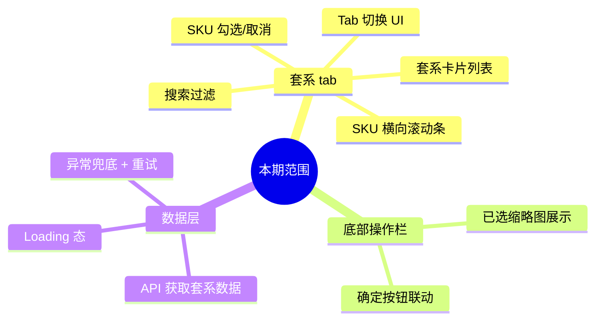

- 商品选择弹窗新增「套系列表」tab，与现有「单品选择」tab 并列
- 套系数据以卡片列表形式展示，每个卡片包含套系名称、套系编号及所含 SKU 缩略图横向滚动条
- 套系内 SKU 支持勾选/取消勾选，勾选逻辑和数量限制与单品 tab 一致
- 套系 tab 内支持按套系名称、套系编号、SKU 规格关键词搜索过滤
- 「确定」按钮行为与单品 tab 保持一致，选中的套系 SKU 进入相同的后续流程
- 套系数据通过 API 获取并展示，含加载态与接口异常兜底

### 2.2 本期不包含

- 套系数据的增删改查后台功能（由后端或其他迭代负责）
- 套系 tab 的分页/无限滚动（首期按全量返回处理，若套系量级增长再迭代）
- 单品 tab 现有功能的修改
- 套系推荐搭配区域（「单品选择」tab 中已有的"系统推荐搭配商品"模块本期不改动）

---

## 3. 产品流程

### 3.1 弹窗整体结构

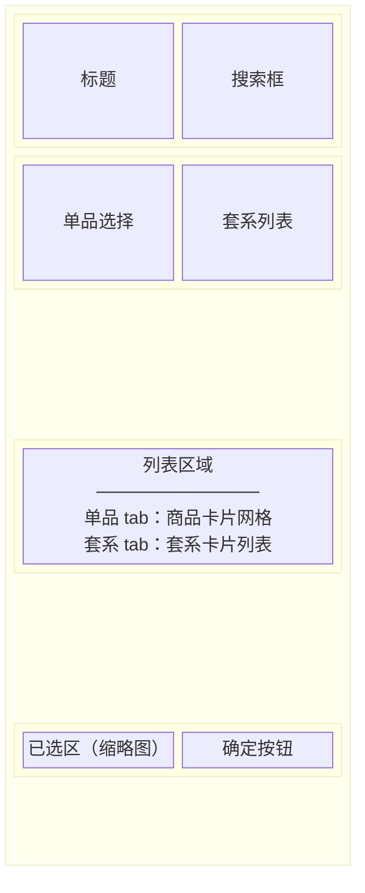

### 3.2 套系 tab 完整操作流程

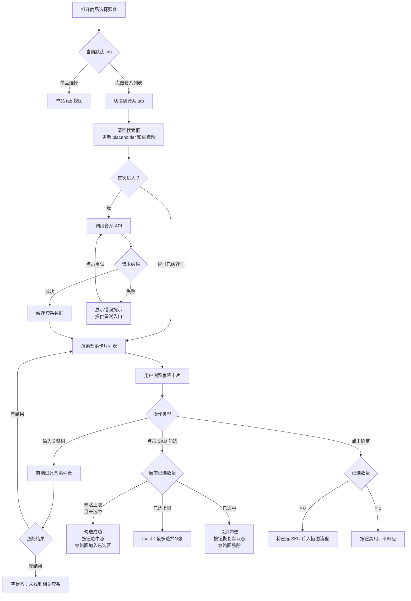

### 3.3 Tab 切换状态机

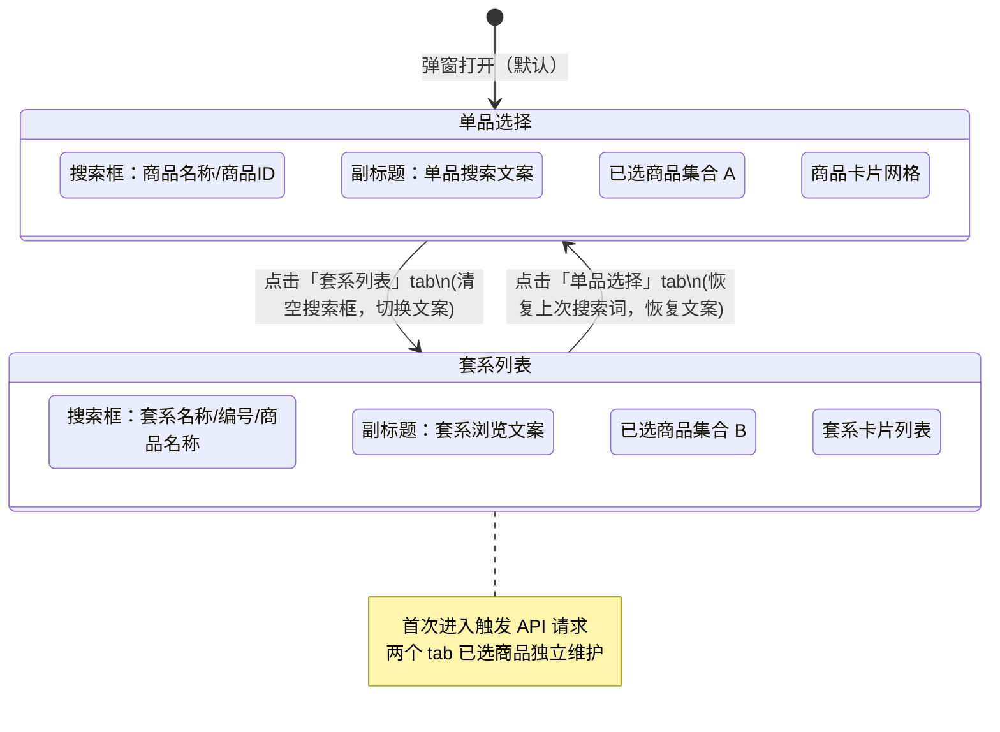

---

## 4. 功能需求

### 4.1 弹窗 Tab 切换

#### 4.1.1 商品选择弹窗 — Tab 栏

> 页面截图：[待补充]
>
> 页面路径：搭图流程 → 选择商品 → 商品选择弹窗

**Tab 标签**

- Tab 栏包含两个标签：「单品选择」（左）、「套系列表」（右）
- 默认激活「单品选择」tab
- 点击未激活的 tab 标签，切换至对应 tab 并更新激活态样式

**搜索框联动**

| 切换方向 | 搜索框行为 | placeholder 变化 |
|---|---|---|
| → 套系 tab | 清空搜索框内容 | → "套系名称 / 编号 / 商品名称" |
| → 单品 tab | 恢复上次搜索关键词 | → "商品名称 / 商品ID" |

**副标题联动**

| 切换方向 | 副标题文案 |
|---|---|
| → 套系 tab | "直接搜索套系，浏览并选择套系中需要的商品" |
| → 单品 tab | 恢复单品 tab 原有副标题文案 |

**数据加载**

- 首次切换到套系 tab 时触发套系数据请求
- 数据加载中展示 loading 态（建议：骨架屏或加载指示器）
- 数据加载失败展示错误提示，并提供"重试"操作入口

---

### 4.2 套系卡片列表

#### 4.2.1 套系 tab 列表区

> 页面截图：[待补充]
>
> 页面路径：商品选择弹窗 → 套系列表 tab

**列表区状态流转**

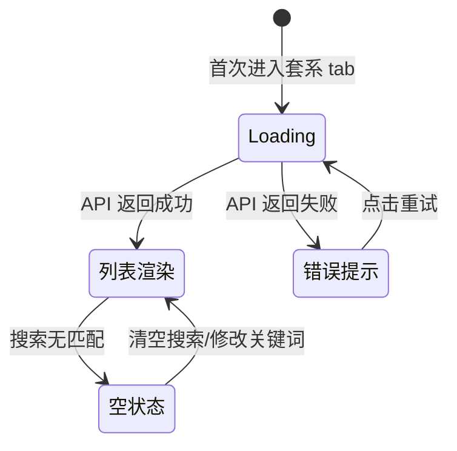

**数据来源**

- 调用套系列表接口获取全量套系数据
- 接口需返回字段：

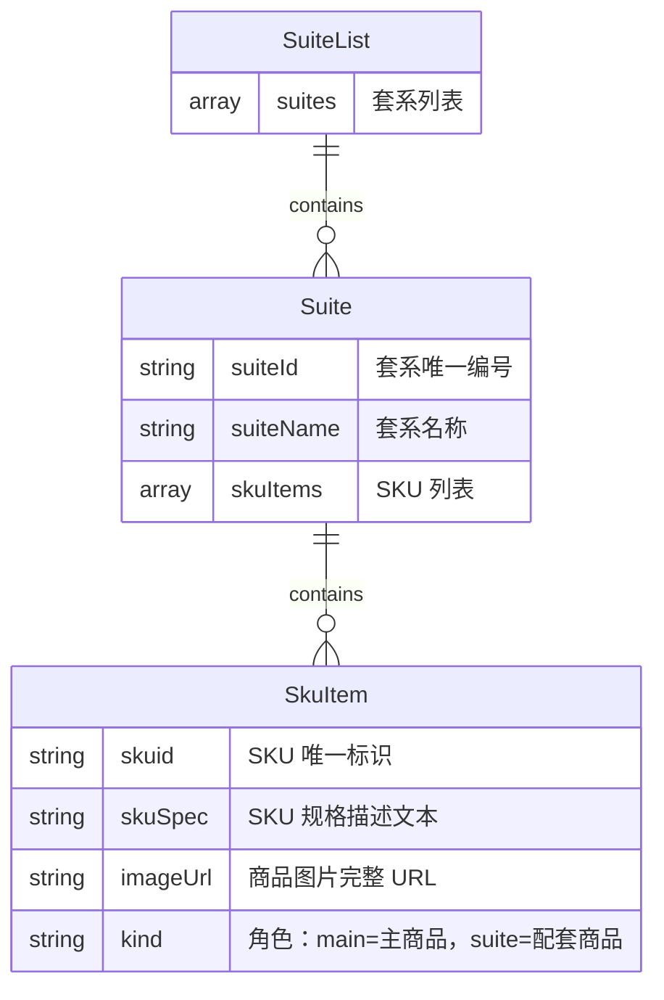

**套系卡片结构**

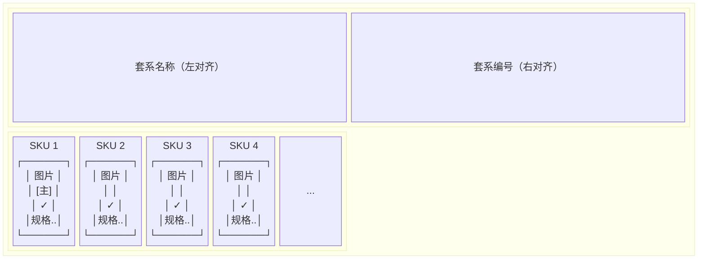

- **卡片头部**：左侧展示套系名称，右侧展示套系编号
- **SKU 横向滚动条**：展示该套系下所有 SKU 的缩略图卡片，支持水平滑动浏览；内容宽度不超出容器时不显示滚动条

**搜索过滤**

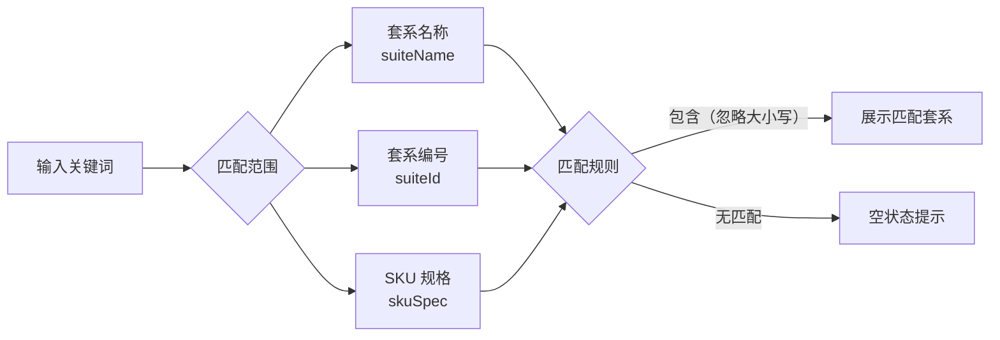

- 搜索框输入关键词后，对已加载的套系列表进行前端过滤
- 匹配范围：套系名称、套系编号、套系内任一 SKU 的规格描述（skuSpec）
- 匹配规则：不区分大小写，包含即匹配
- 过滤后无结果时，列表区展示空状态文案："未找到相关套系，换个关键词试试"

---

### 4.3 SKU 卡片

#### 4.3.1 套系 tab — SKU 卡片

> 页面截图：[待补充]

**卡片元素（从上到下）**

| 序号 | 元素 | 说明 |
|---|---|---|
| 1 | 商品图片 | 展示 `imageUrl`；加载失败展示占位图 |
| 2 | 「主」标签 | 仅当 `kind === "main"` 时展示，位于图片区域角标位置 |
| 3 | 勾选按钮 (✓) | 点击切换选中/未选中状态；达上限时禁用 |
| 4 | 规格描述 | 展示 `skuSpec`，单行省略 |

**勾选状态流转**

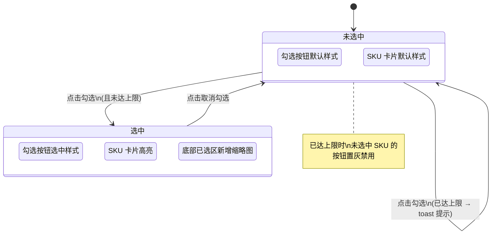

**勾选限制规则**

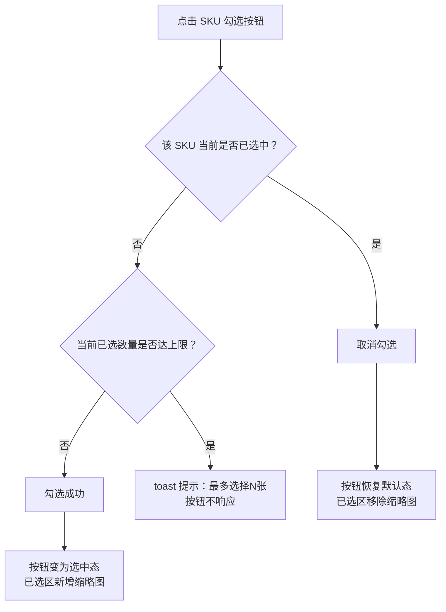

**与单品 tab 的一致性**

- 套系 tab 的 SKU 勾选/取消勾选逻辑与单品 tab 完全一致
- 数量上限规则与单品 tab 共用同一配置
- 「确定」后选中的套系 SKU 进入与单品 SKU 相同的后续处理流程
- 套系 SKU 选中的数据额外记录来源套系编号（`suiteId`）用于追溯

---

### 4.4 底部已选区与确定按钮

#### 4.4.1 商品选择弹窗 — 底部操作栏

> 页面截图：[待补充]

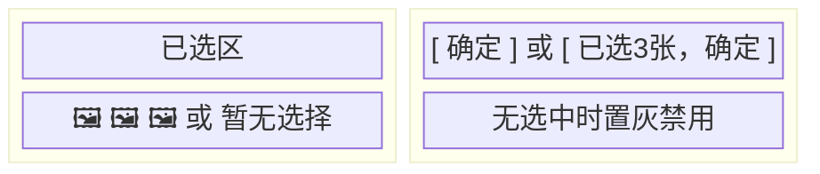

**已选区**

- 展示当前 tab 已选中的 SKU 商品缩略图，横向排列
- 套系 tab 的已选区展示逻辑与单品 tab 一致
- 无选择时展示"暂无选择"占位文案
- 切换 tab 时，已选区展示对应 tab 的已选商品

**确定按钮状态**

| 条件 | 按钮文案 | 按钮状态 |
|---|---|---|
| 已选数量 = 0 | "确定" | 置灰禁用 |
| 已选数量 > 0 | "已选N张，确定" | 可点击 |

- 点击确定后，将当前 tab 的已选 SKU 列表传入后续搭图流程，行为与单品 tab 一致

**确认提交流程**

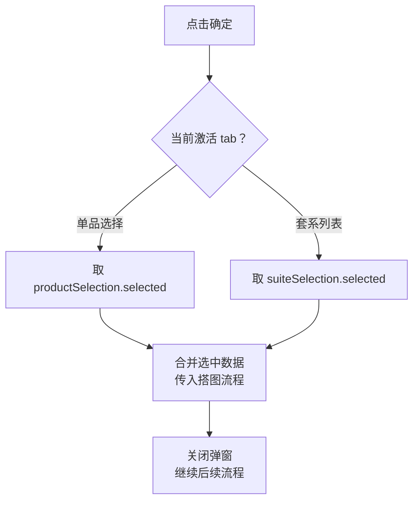

---

## 5. 验收标准

### 5.1 Tab 切换

- [ ] 打开商品选择弹窗，默认激活「单品选择」tab
- [ ] 点击「套系列表」tab，切换至套系列表视图，搜索框清空、placeholder 和副标题变为套系专属文案
- [ ] 从套系 tab 切回单品 tab，单品 tab 的搜索关键词和已选状态保持不变

### 5.2 数据加载

- [ ] 首次进入套系 tab 时，展示 loading 状态
- [ ] 套系数据加载成功后，正确渲染所有套系卡片及 SKU
- [ ] 接口请求失败时，展示错误提示并提供重试入口；点击重试可重新请求

### 5.3 套系卡片展示

- [ ] 每个套系卡片正确展示：套系名称、套系编号、SKU 横向滚动条
- [ ] SKU 横向滚动条可正常水平滑动
- [ ] SKU 图片正确加载展示；图片加载失败时展示占位图
- [ ] `kind` 为 `"main"` 的 SKU 正确展示「主」标签，非 `"main"` 的 SKU 不展示
- [ ] SKU 规格描述文本完整展示（单行省略）

### 5.4 搜索过滤

- [ ] 输入套系名称关键词，正确过滤出匹配的套系
- [ ] 输入套系编号关键词，正确过滤出匹配的套系
- [ ] 输入 SKU 规格中的关键词，正确过滤出包含该 SKU 的套系
- [ ] 搜索不区分大小写
- [ ] 无匹配结果时展示"未找到相关套系，换个关键词试试"
- [ ] 清空搜索框后恢复展示全部套系

### 5.5 SKU 勾选

- [ ] 点击 SKU 勾选按钮可选中，按钮变为选中态，底部已选区出现对应缩略图
- [ ] 再次点击已选中的勾选按钮可取消选中，按钮恢复默认态，底部已选区移除对应缩略图
- [ ] 已选数量达到上限时，未选中 SKU 的勾选按钮置灰不可点击
- [ ] 已达上限时点击禁用按钮，toast 提示"最多选择N张"
- [ ] 已达上限时，已选中的 SKU 仍可取消勾选

### 5.6 确定按钮

- [ ] 无选中时，按钮展示"确定"且置灰禁用
- [ ] 有选中时，按钮展示"已选N张，确定"且可点击
- [ ] 点击确定后，套系 tab 选中的 SKU 进入后续搭图流程，处理逻辑与单品 tab 一致
- [ ] 套系 SKU 选中数据中包含来源套系编号（`suiteId`）用于追溯

### 5.7 兼容性

- [ ] 单品 tab 原有全部功能不受影响
- [ ] 已有的"系统推荐搭配商品"区域（单品 tab 内）展示和交互不受影响
